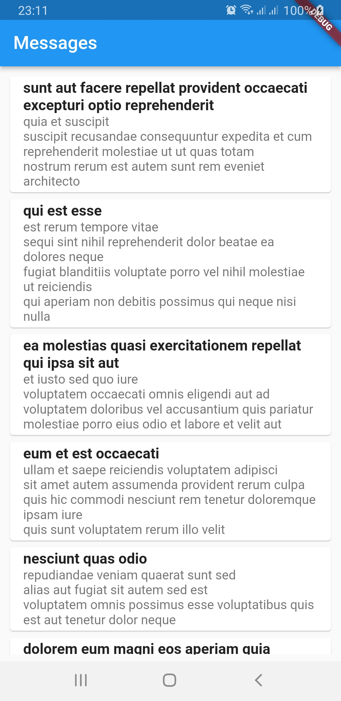
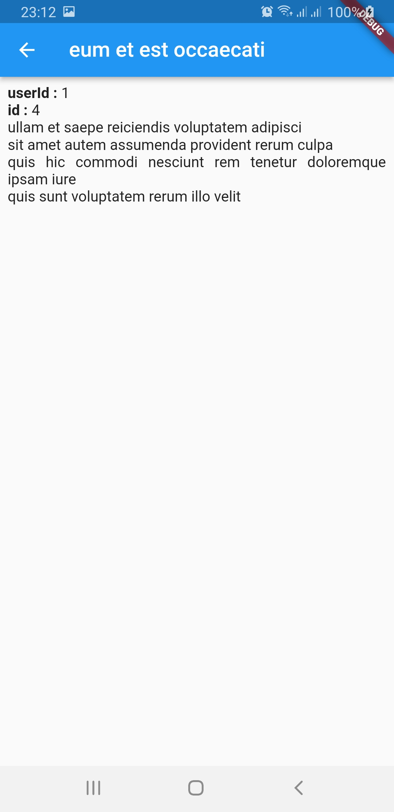
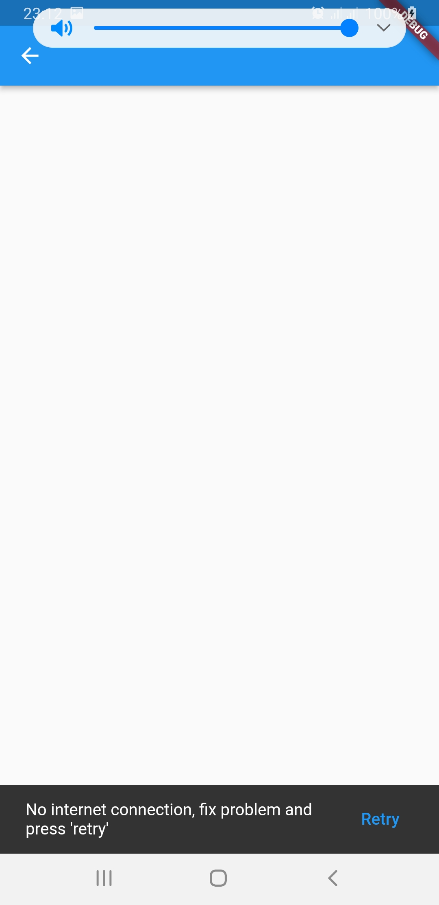

## Flutter test_task
This app is a client-server application, which use the API from [https://jsonplaceholder.typicode.com/] (https://jsonplaceholder.typicode.com/).

This application shows list of posts from API on the home screen, and shows details screen with a single post, when tap on the item in the list.

Clean architecture and pattern repository was used to create the application.

Also in this app applied next technologies:
* http
* Flutter BLoC
* Equtable

This app has own set of errors, and can help user understend the problem.
